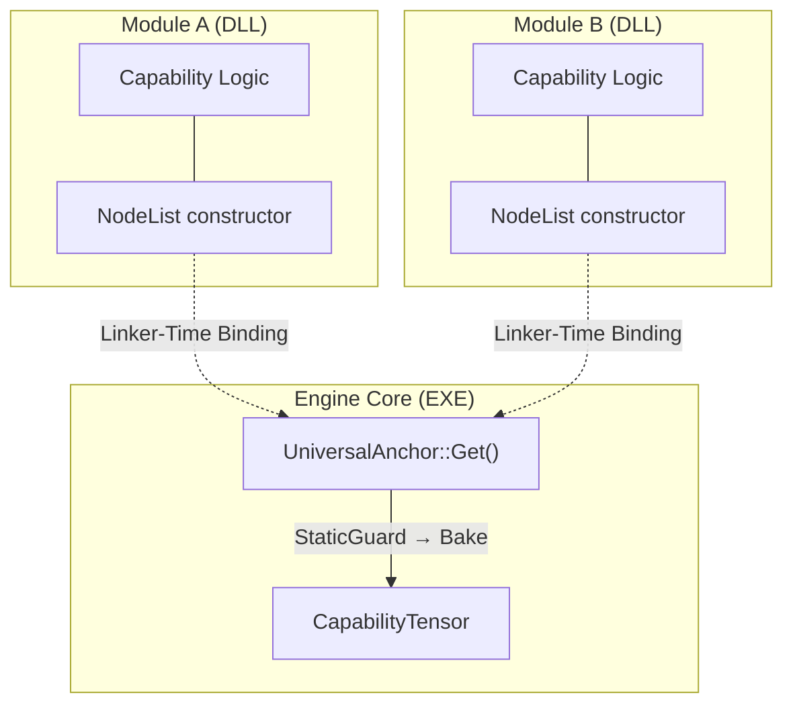
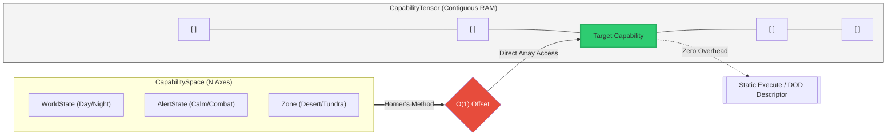

# Capability Routing Grid (CRG)

**Reaching the Hardware Limit: Universal Decoupling and Zero-Cost Capability Routing in C++**

[Technical White Paper](paper/paper.md) | [Launch Interactive Simulator](https://ct-74.github.io/CapabilityRoutingGateway/demo/final_simulator/index.html) | [Tensor Visualizer](https://ct-74.github.io/CapabilityRoutingGateway/demo/tensor_visualizer/index.html)

## Overview

CRG is a **linker-driven, zero-allocation capability dispatch framework** for any C++ system requiring decoupled module discovery and high-performance capability routing. 

It is not a game engine framework; it is a general-purpose architectural pattern applicable to plugin systems, simulations, tools, rule engines, and any system where modules must register capabilities without the core knowing they exist.

CRG delivers three guarantees:

| Guarantee          | Mechanism                         | Result                                           |
| :----------------- | :-------------------------------- | :----------------------------------------------- |
| **Zero Coupling** | NodeList + UniversalAnchor           | Modules self-register. The linker resolves them. |
| **Zero Search** | CapabilitySpace + Horner's method | Context is a coordinate. O(1) array offset.      |
| **Zero Migration** | Immutable CapabilityTensor        | Topology never changes. Prefetcher never blinks. |

---

## Plugin System — For Free

As a direct consequence of its linker-driven architecture, CRG provides a fully functional plugin system at zero infrastructure cost. Define a struct, instantiate it as a static global — the OS fires the constructor on load, and the capability is automatically registered. No `Init()` function, no central registry, and no knowledge of other modules is required.
```cpp
struct MyFeatureList : NodeList<MyFeatureList, ICapability> {};

// Drop this file anywhere. Link the binary. It wires itself.
struct MyFeature : MyFeatureList {
    void Execute(const ModelShell& shell) const override { /* ... */ }
};
static MyFeature g_feature; // ← OS loads, constructor fires. Done.
```

Supports both **monolithic** (static lib, ship builds) and **DLL** (dev, tools, hot-reload) topologies via a single macro switch — `CRG_DEFINE_UNIVERSAL_ANCHOR` — with no GPP-facing changes.

---

## Pillar I: Linker-Driven Discovery

The engine core requires no knowledge of external modules. Capabilities self-register via `NodeList` into a `UniversalAnchor` anchor. On the first `CapabilityRouter::Find()` call, a `StaticGuard` triggers the Bake — flattening the linked list into the contiguous `CapabilityTensor` exactly once.



---

## Pillar II: N-Dimensional Behavior Projection

Behaviors are resolved via a flat `CapabilityTensor` indexed by two values: a `DenseTypeID` (model row) and a `CapabilitySpace` offset (context column). The offset is computed via Horner's method — one accumulation loop, no branches, O(1) regardless of the number of axes.




---

## Pillar III: ECS Symbiosis (ActiveCapability)

Stage 12 introduces the **ActiveCapability**, a zero-cost bridge between the tensor-based resolution and high-frequency ECS loops. By caching resolved `DODDescriptor` pointers, CRG eliminates the need for repeated lookups or structural migrations during the hot-path.
```cpp
struct EnergySystem {
    // Capability cache: no resolution overhead during hot-path execution
    std::vector<ActiveCapability<EnergyContract>> drainCaps;

    void Execute() {
        for (std::size_t i = 0; i < entities.size(); ++i) {
            EnergyContract::Params params { batteries[i] };
            drainCaps[i](params); // Direct call via DODDescriptor
        }
    }
};
```

---

## Performance: Stage 12 Results

CRG saturates physical memory bandwidth by maintaining **structural immutability**. At high mutation rates (10%), where traditional ECS suffers from archetype migration costs (Swap & Pop), CRG provides a significant performance advantage.

| Dataset Size          | Implementation     | Execution Time    | Throughput     | Overhead vs CRG |
| :-------------------- | :----------------- | :---------------- | :------------- | :-------------- |
| **64k (Cache-bound)** | ECS (10% mutation) | 7,973,240 ns      | 35.23 Gi/s     | **1.99x** |
|                       | **CRG Routing** | **4,006,653 ns** | **70.23 Gi/s** | **Baseline** |
| **1M (Memory-bound)** | ECS (10% mutation) | 126,653,300 ns    | 19.26 Gi/s     | **1.60x** |
|                       | **CRG Routing** | **79,158,312 ns** | **30.83 Gi/s** | **Baseline** |

*Hardware: Apple M-Series (clang -O3). Throughput calculated for 64-byte aligned structures.*

### 🎬 Live Stress Test: The Memory Wall
<div align="center">
  <video src="https://github.com/user-attachments/assets/8c464085-1856-439a-9fad-517db26dbb09" width="100%" controls autoplay loop muted>
    Your browser does not support HTML5 video. Here is a <a href="https://github.com/user-attachments/assets/8c464085-1856-439a-9fad-517db26dbb09">direct link to the video</a>.
  </video>
  <br>
  <p><i>Real-time simulation (50k entities): CRG (Green) remains immune to structural churn while traditional ECS (Red) collapses under memory migration costs.</i></p>
</div>

---

## Architectural Decision Matrix (ECS vs CRG)

CRG is not a replacement for ECS, but a specialized engine for **high-complexity, volatile logic**. The mathematical break-even point between traditional ECS (Structural Migration) and CRG (Pointer Update via `ActiveCapability`) is dictated by two factors: **Entity Size** and **Structural Mutation Rate**.


* **ECS Supremacy (Static Loops & Micro-Entities):** For data payloads under the 64-byte threshold (e.g., 32 bytes) or systems with rare state changes (<4% mutation rate), ECS remains mathematically superior. The memory copy cost of a rare `Swap & Pop` is negligible compared to the baseline indirection of a DOD pointer. ECS is the absolute architecture for updating millions of static particles.
* **CRG Supremacy (Zero-Migration & Heavy Logic):** The moment entities cross the 64-byte cache-line threshold, or their state mutates frequently (>4%), CRG takes over. By completely eliminating physical memory migrations, CRG allows the hardware prefetcher to stream continuous arrays without interruption. For complex GamePlay code, AI state machines, and volatile business logic, CRG effectively doubles your memory bandwidth efficiency.

---

## Progressive Demo

The `demo/` folder contains 12 stages, each building on the previous:

| Stage     | Concept                                            |
| :-------- | :------------------------------------------------- |
| `stage00` | God Registry — the problem                         |
| `stage01` | Intrusive Infrastructure (NodeList + UniversalAnchor) |
| `stage02` | Opaque Transport (ModelShell)                      |
| `stage03` | Traversal Lookup                                   |
| `stage04` | Identity Decoupling (CapabilityBinding)            |
| `stage05` | Model Router (Invoke / TryInvoke)                  |
| `stage06` | Fusion (CapabilityBinding)                           |
| `stage07` | Temporal Axis                                      |
| `stage08` | N-Dimensional Space (CapabilitySpace + Horner)     |
| `stage09` | Dynamic Rules (Narrow Phase)                       |
| `stage10` | Flat Tensor Dispatch (DenseTypeID)                 |
| `stage11` | Stateless DOD                                      |
| `stage12` | ECS Symbiosis (ActiveCapability)                   |

---

**Implementation Note:** *The provided source code is a **reference implementation** focused on architectural clarity and portability. To maintain a clean-room approach and ensure readability, certain hardware-specific optimizations (such as manual SBO memory management) have been replaced by standard C++ constructs (e.g., `std::unique_ptr`). In a production environment, these should be replaced by the hardware-aligned structures described in the white paper.*

**Author:** Cyril Tissier  
**License:** Apache 2.0  

**Legal Disclaimer:** *This repository represents independent research and a clean-room implementation of the Capability Routing Grid architecture. All code and documentation were developed personally by the author. This project is independent of, and does not contain any proprietary or confidential information from, any past or present employer.*